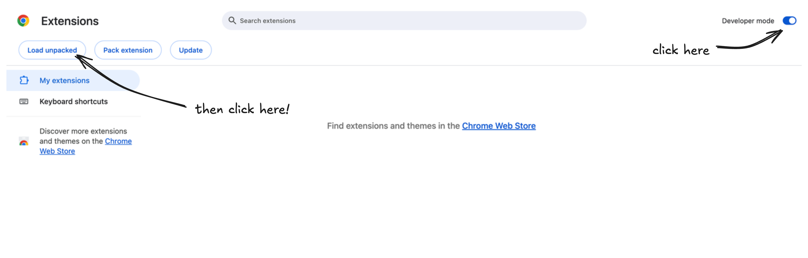

### About
**Chrome Tab Counter** is completely free and open source. Multiple versions of the app are hosted in this repository, the newest one is timer-v2.

### How to use

#### timer-v1
`timer-v1` is vanilla javascript. In order to run it, go to [link chrome://extensions](chrome://extensions) (Edge is [link edge://extensions](edge://extensions) and Brave is [link brave://extensions](brave://extensions)). Turn on developer mode, then press `upload unpacked` and select `timer-v1` to use it.


#### timer-v2
`timer-v2` uses Vite and React, so it must be build into standard HTML and JavaScript before being uploaded. In the terminal, write:
```bash
cd timer-v2
npm i
npm run build
```
After that, upload the file to [link chrome://extensions](chrome://extensions), just as with `timer-v1`:


**Important:** the path `timer-v2` builds to is `timer-v2/dist`, so upload `timer-v2/dist` instead.